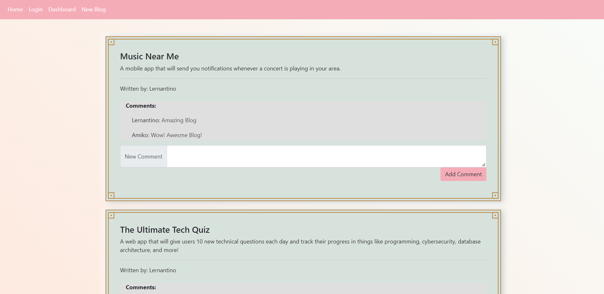

# [Blogging Application](https://blogging-site-henry.herokuapp.com/)

 

 

<h3 align="center">Blogging Application</h3>

  

    Application for blogging
     
  

  
Table of Contents

  <ol>
    <li><a href="#about-the-project">About The Project</a></li>
    <li><a href="#tools">Tools</a></li>
    <li><a href="#instructions">Instructions</a></li>
    <li><a href="#usage">Usage</a></li>
    <li><a href="#license">License</a></li>
    <li><a href="#contact">Contact</a></li>
  </ol>

## About The Project

The motivation behind this project is to create an intuitive site for creating, reading and commenting on blog posts. 

The applicaiton relies on SQL to maintain user, blog and comment data as well as Javascript and Node.js for processing on the backend. Once the data has been processed, a webpage is rendered and displayed through Handlebar.js.

(<a href="#top">back to top</a>)

### Tools

* JavaScript
* SQL
* Node.js
* Handlebar.js

(<a href="#top">back to top</a>)

## Instructions

Navigate to the following link to access the live application: [Blogging Application](https://blogging-site-henry.herokuapp.com/)

## Usage

* Once you navigate to the live applicaiton linked above, you are presented with blogs previously saved on the application.
* You are able to login into the application by selecting <i>Login</i> from the navigation bar. 
* Once you login to the application, you are able to navigate to your dashboard to view, edit and delete previously created blogs.
* Once you are logged in, you are also able to create new blogs by selecting <i>New Blog</i> from the navigation bar, which are then saved within the blogging application's database.

(<a href="#top">back to top</a>)

## License

 Distributed under the MIT License. See `LICENSE.txt` for more information.

(<a href="#top">back to top</a>)

## Contact

Henry Nguyen -  hln11244@gmail.com

Repository Link: [https://github.com/henry11244/Blogging-Site](https://github.com/henry11244/Blogging-Site)

linkedIn: https://www.linkedin.com/in/henry11244/

(<a href="#top">back to top</a>)

